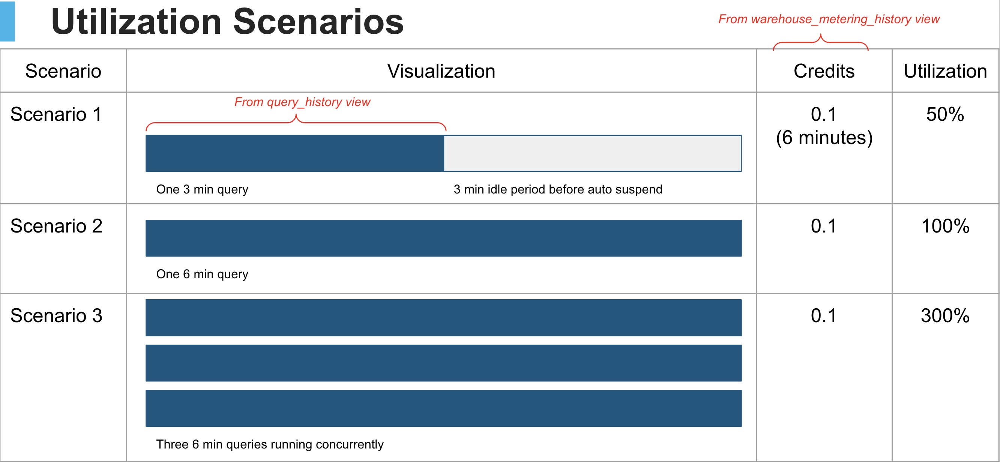

# Snowflake Warehouse Utilization
See how your well your Snowflake queries are utilizing your warehouses

## How to Install:
```
conda create -n snowflake-warehouse-utilization python=3.8
conda activate snowflake-warehouse-utilization
```

Then run one of the following:
```
pip install streamlit
pip install git+https://github.com/sfc-gh-brianhess/st_connection.git#egg=st_connection
pip install pyarrow~=8.0.0
pip install matplotlib
```

or

```
pipenv install
pipenv shell
pipenv install streamlit
pipenv install git+https://github.com/sfc-gh-brianhess/st_connection.git#egg=st_connection
pipenv install pyarrow~=8.0.0
pipenv install matplotlib
```

## How to Run:
```
streamlit run streamlit_app.py
```

## How To Use This Dashboard
[Snowflake costs](https://docs.snowflake.com/en/user-guide/admin-usage-billing.html) are primarily based on usage of data storage and the number of virtual warehouses you use, how long they run, and their size. 
            
Because warehouses continue to bill even when idle, a calculation can be performed to identify the Warehouse Utilization by comparing the time spent querying (as calculated from the `query_history` view) versus the actual credits billed (as provided by `warehouse_metering_history`).

A 100% utilization would be obtained by always running sequential queries and then automatically suspending immediately after execution. However, some scenarios would cause a utilization less than 100% such as:
* Auto Suspend Periods
* The 60 second warehouse uptime minimum.

A utilization of >100% could be obtained by running queries concurrently. 



A low utilization does is not implicitly a bad thing, but could indicate there are opportunities to optimize. Some techniques may include:

* Reducing the auto suspend period of a warehouse by running `ALTER WAREHOUSE <WAREHOUSE NAME> SET AUTO_SUSPEND=60`

* Consolidating warehousing to leverage the uptime of other like sized warehouses

For more information and suggestions on how to optimize your Snowflake environment, reach out to your Snowflake Account team!